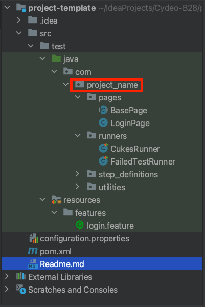
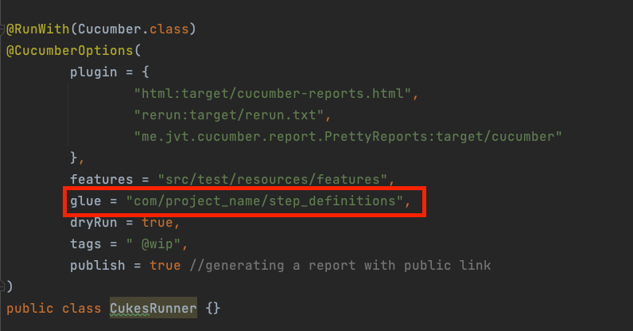
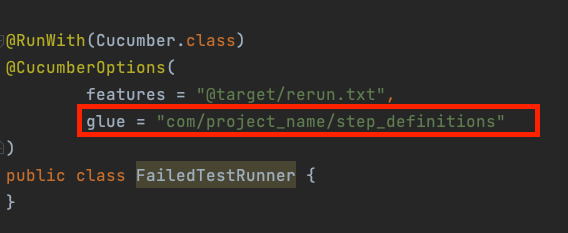
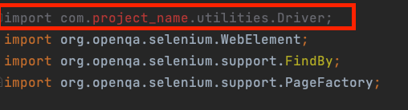

# Template Automation Framework For Project Implementation

-  Team Lead and members clone that project
-  Then team will create their own project by using that template which has all folder structure and dependencies 
   are needed

# While project creation:

     1. Team will use own project name for
    package name
  

    2. Copy runners package and paste under project package     

    3. Change CukesRunner glue key

    4. Change FailedTestRunner glue

     5. Copy features directory paste in your resources directory
 
     6. Copy step_definitions packege and paste under your project package

     7. Copy pages package and paste under your project package

     8. Copy utilities package and paste under your project package

# *** IMPORTANT *** 

 - Fix your each class import statements

